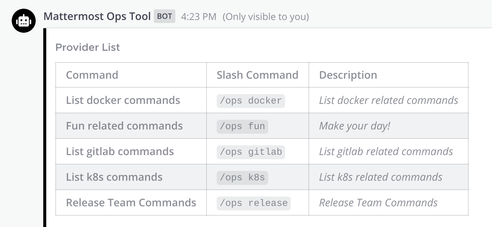
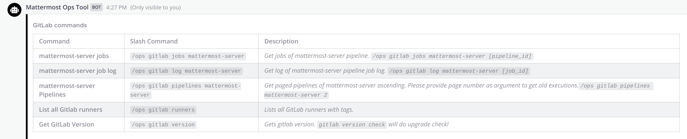
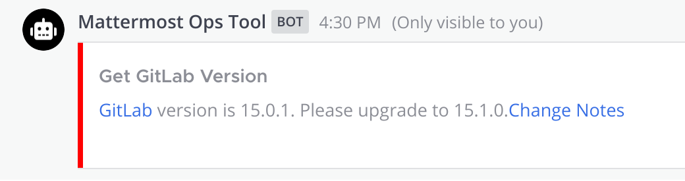
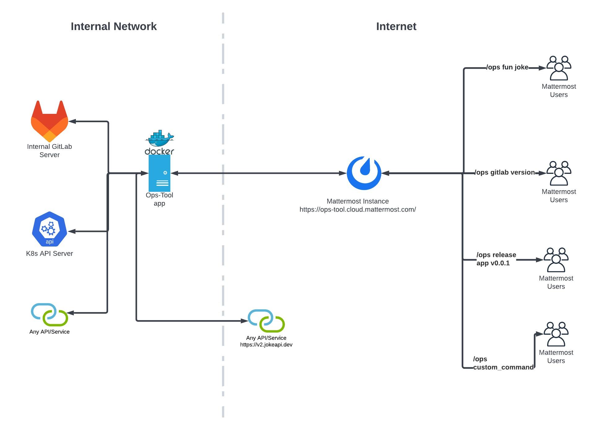
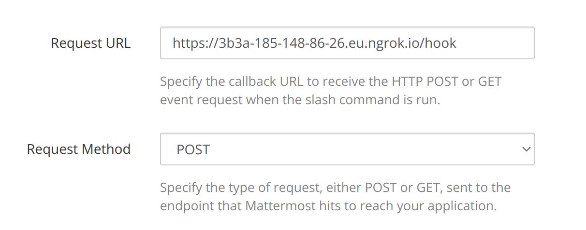

# ops-tool
An abstract tool for DevOps which streamlines day to day operations. It allow teams to implement custom workflows, dialogs, integrations and bind that pipeline to Mattermost slash commands. See `commands ` folder for sample integrations. For more information check `doc` folder.

It will allow to integrate many providers and workflows by using configuration files. Ie.



For every provider it is possible to register different commands by only using configuration files.



See documents how to configure provider and register commands. Sample configuration:

```yaml
- command: "version"
  name: "Get GitLab Version"
  description: "Gets gitlab version. `gitlab version check` will do upgrade check!"
  exec: 
    - scripts/gitlab/gitlab_version.sh
  response:
    type: "ephemeral"
    colors:
    - color: "#ff0000"
      status: "upgrade"
    - color: "#00ff00"
      status: "ok"
    template: |
      {{ if eq .Status "upgrade" }}
      [GitLab](https://git.internal.mattermost.com) version is {{ .Data.version }}. Please upgrade to {{ .Data.latest }}.[Change Notes]({{ .Data.change_notes_url }})
      {{ else }}
      [GitLab](https://git.internal.mattermost.com) version is {{ .Data.version }}. {{ if .Data.latest }} Upgrade is not needed! {{ end }}
      {{ end }}  

```

Sample command output: `/ops gitlab version check`



## Architecture Example

In the following example, several Mattermost clients, are invoking `/ops` commands, to interact with remote APIs accessed by the ops-tool. 



## Get Involved

- [Join the discussion on ~Developers: DevOps](https://community.mattermost.com/core/channels/build)

## Developing

### Environment Setup

Essentials:

1. Install [Go](https://golang.org/doc/install)
2. Install [jq](https://stedolan.github.io/jq/download/)

Optionals:

For local installations public tunnel is not needed. For cloud Mattermost servers :

1. Public tunnel to expose local endpoints to the internet if needed. ie. [Ngrok](https://ngrok.com/).


See `config.sample.yaml` for sample and read documentation how to configure the tool.

### Configuration

1. Create a [Bot account](https://developers.mattermost.com/integrate/admin-guide/admin-bot-accounts/).
2. If Public tunnel is needed, configure your tunnel.
3. Create [Slash command](https://developers.mattermost.com/integrate/admin-guide/admin-slash-commands/). Enter `<BASE_URL>/hook` to `Request URL`  and select `POST` as request method.

    
4. Create a [Incoming Webhook](https://developers.mattermost.com/integrate/admin-guide/admin-webhooks-incoming/). Do not select lock to this channel. It will be used for dialog and forms.
2. Define command group configuration locations at configuration file in `commands` sections. 
3. Define scheduled command definitions in configuration.
4. Define commands at commands folder.
5. Prepared scripts at scripts folder.

See documentation for detailed configuration and command reference.

### Running

To execute locally:

```shell
make go-run
```

### Testing

Running all tests:

```shell
make test
```

